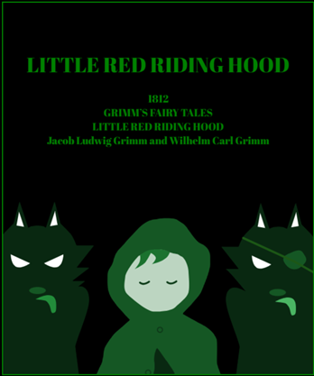

# adventure
Rust WebAssembly mini adventure game

=======
adventure 🎨
========
Programming mini game for Demo in Rust & WebAssembly

[](https://myurioka.github.io/adventure/)

[Play in browser](https://myurioka.github.io/adventure)

### How to play (Control)

  * Input Gemini API_KEY in Textbox.
  * Input English Sentence in Textbox.
  * Message from Gemini will be displayed.
  * There are 8 questions in total.

### Requirement
  * Rust, Cargo
  * WASM

### How to Build & Run

  ```sh
  $ cd adventure
  $ pnpm build-wasm
  $ pnpm dev --open
  ```
  Browse http://localhost:5173
