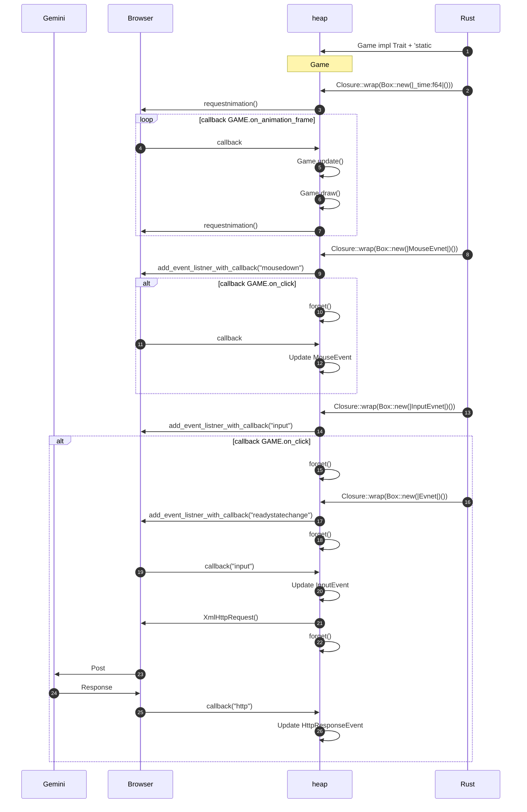

# adventure
Rust WebAssembly mini adventure game
=======
adventure 🐺
========
Programming mini game for Demo in Rust & WebAssembly

[](https://myurioka.github.io/adventure/)

[Play in browser](https://myurioka.github.io/adventure)

### How to play (Control)

  * Input Gemini API_KEY in Textbox.
  * Input English Sentence in Textbox.
  * Message from Gemini will be displayed.
  * There are 8 questions in total.

### Requirement
  * Rust, Cargo
  * WASM

### How to Build & Run

  ```sh
  $ cd adventure
  $ pnpm build-wasm
  $ pnpm dev --open
  ```
  Browse http://localhost:5173

### Sequence Diagram


<br />
[Previous](https://zenn.dev/yurioka/articles/e69f247dc6ec63)

 Here is the added content from: 
<br />

<ol>
<li style="list-style:none;">13. set interface funtion(closure) for Input text </li>
<li style="list-style:none;">16. set interface function(closure) for Http Respnse</li>
<li style="list-style:none;">19. From the 'input' event, it will: On the first, store the Gemini API key.<li>
<li style="list-style:none;">From the 'input' event, it will: On subsequest, store the text entered in INPUT_TEXT</li>
<li style="list-style:none;">21. Wasm will request a POST to the Gemini API from the browser.</li>
    ```<br />
    XmlHttpRequest.open("POST", <Gemini_api_endpoint>)<br />
    XmlHttpRequest.set_request_header(<Content-Type>)<br />
    XmlHttpRequest.send_with_opt_str(<Payload>)<br />
    ```<br />
<li>23. The browser will request a POST to the Gemini API.</li>
<li>callback → 16: Closure::wrap(Box::new(|_event)|)</li>
<li>set message from GeminiAPI to Game Object</li>
</ol>